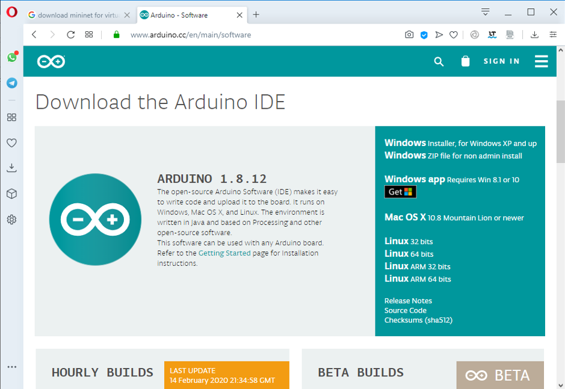
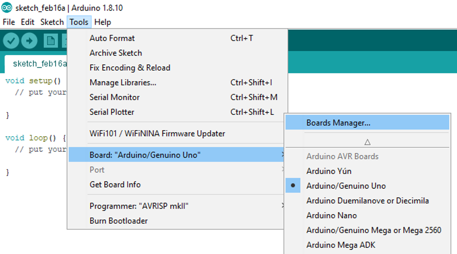
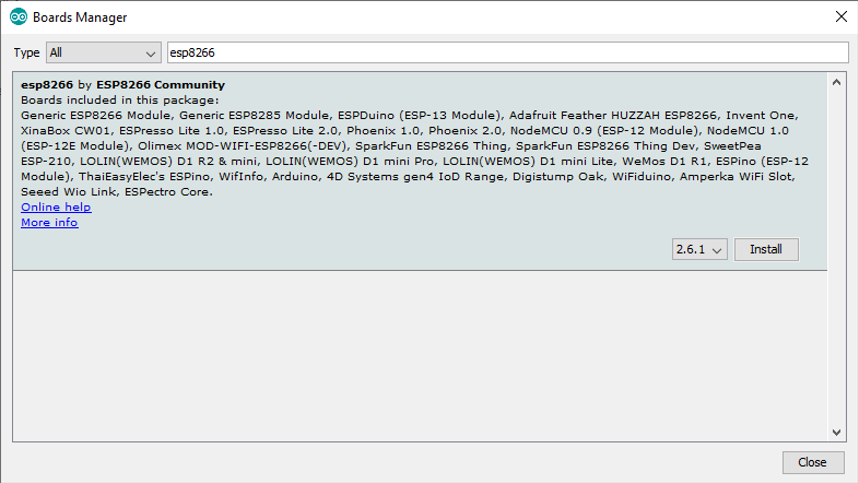
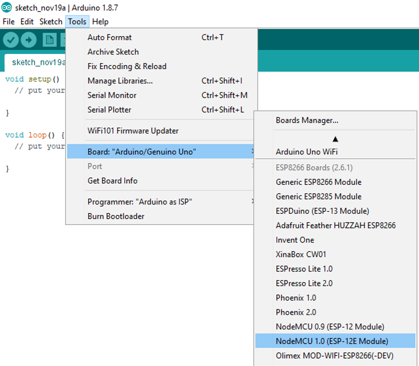
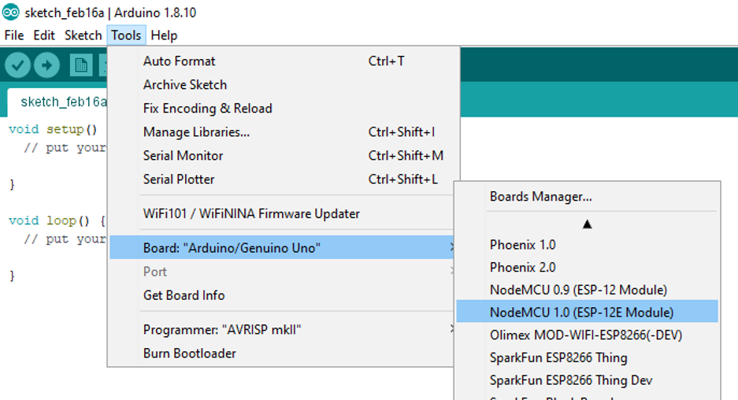
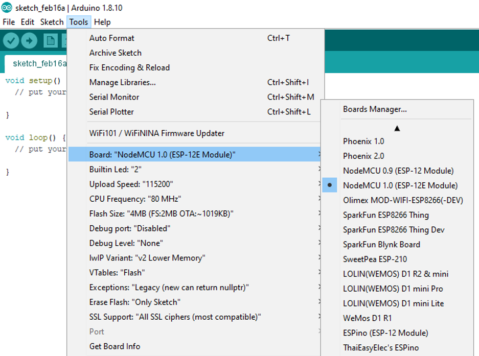
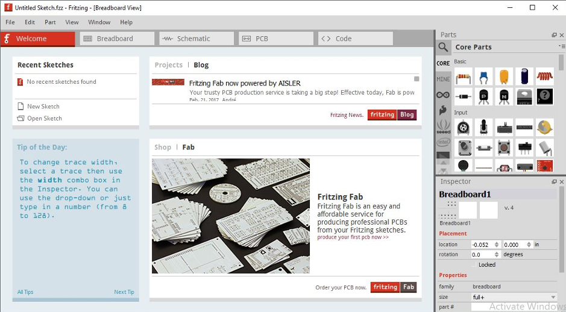

# Instalasi & Konfigurasi software & Hardware pendukung, Cara pengoperasian software, Merangkai MCU dengan beberapa sensor, aktuator dan LCD, Dasar koding MCU dan Writing
## IDE Arduino dan Library Board NodeMCU ESP8266
+ Install Arduino IDE, download dari link https://www.arduino.cc/download_handler.php?f=/arduino-1.8.12-windows.exe.
    
+ Buka aplikasi arduino IDE
+ Buka menu File > Preferences. 
    
+ Pada kolom "Additional Boards Manager URLs", tulis atau copy-paster alamat berikut 
`https://arduino.esp8266.com/stable/package_esp8266com_index.json`. kemudian klik OK.
    
+ Buka menu Tools > Board > Board Manager. Tuliskan "esp8266" dalam kolom search field. Kalimat "esp8266 by ESP8266 
Community" akan nampak pada daftar di bawahnya, pilih dan klik tombol Install di sebelah kanan bawah.
    
    
    > Tuliskan pada pencarian `esp8266`
      Klik tombol install, jika gagal turunkan versinya dari 2.6.3 ke 2.6.1                                                                                                                                                                                                                                                              
    
    
    
    Proses installasi ditunjukkan progress bar seperti pada gambar di bawahi ini
    
    
    
+ Buka menu dan pilih Tools > Board Manager > NodeMCU 1.0 (ESP-12E Module)
    
    Ketika proses installasi telah selesai dan telah memilih board, seharusnya akan tampil `NodeMCU 1.0 (ESP-12E Module)`
    
 
+ Sekarang masukkan kabel data USB dari NodeMCU ke Laptop, kemudian cek terlebih dahulu di Control Panel > Device 
Manager. Gambar di bawah menunjukkan bahwa interface antara NodeMCU dan Laptop Windows 10 telah terhubung melalui 
PORT COM3 (alamat COM setiap orang tidak selalu sama, tergantung dari komputer masing-masing).
    
    > Ketika port belum terdeteksi, maka harus install terlebih dahulu drivernya yang dapat diunduh di 
    [https://www.silabs.com/products/development-tools/software/usb-to-uart-bridge-vcp-drivers](https://www.silabs.com/products/development-tools/software/usb-to-uart-bridge-vcp-drivers)
    
+ Buka aplikasi Arduino IDE, pilih menu Tools > Board, yang semula defaultnya mungkin “Board: Arduino / Genuino Uno” 
menjadi “NodeMCU 1.0 (ESP-12E Module)”
    
    
    > Board NodeMCU adalah board yang saat ini, NodeMCU 1.0 (ESP-12E Module) aktif
    
    

+ Buka aplikasi Arduino IDE pada menu Tools > Port > COM3 (sesuaikan dengan nomor port masing-masing) .
    
    
+ Jalankan aplikasi standard seperti di bawah ini, kemudian klik tombol centang di bagian toolbar atas.
    
 
Jika tidak ada pesan error, berarti instalasi sukses dan siap digunakan

## Fritzing Designer
Fritzing designer adalah aplikasi untuk membuat skema pengabelan untuk komponen-komponen yang dibutuhkan, misalnya 
Micrcontroller Unit (NodeMCU, Arduino dll), berbagai jenis module sensor dan aktuator serta komponen-komponen pendukung lainnya.
 
Aplikasi Fritzing tidak wajib diinstal, aplikasi ini hanya sekedar membantu Anda menggambar suatu rangkaian sebagai 
bahan ilkustrasi untuk memudahkan pemahaman saat dilakukan pengkabelan komponen atau modul. 

Ikuti langkah berikut ini untuk meng-install aplikasi Fritzing
+ Download file ZIP Fritzing di website berikut [http://fritzing.org/download/](http://fritzing.org/download/). 
Pilihan file Fritzing disesuaikan dengan sistem operasi Windows yang Anda miliki, misalnya 32bit atau 64bit.
+ Sebagai contoh file Fritzing windows 32bit adalah `fritzing.0.9.3b.32.pc.zip.` Kemudian uraikan file ZIP tersebut dengan 
aplikasi 7z, Winzip atau sejenisnya.
+ Jalankan Aplikasi Fritzing Fritzing.exe. Jika sukses maka tampilan fritzing akan seperti tampak pada Gambar 2.9.

    

Anda tinggal melakukan drag dan drop gambar komponen di sebelah kanan ke media rancangan di sebelah kiri. Jika komponen 
yang dibutuhkan tidak ditemukan, maka Anda dapat men-download library komponen tambahan yang dapat diperoleh di internet 
(biasanya file yang berekstensi .fzpz). Selanjutnya lakukan import terhadap file library .fzpz untuk dimasukkan ke 
library komponen baru.

Berikut contoh penggunaan fritzing deigner
