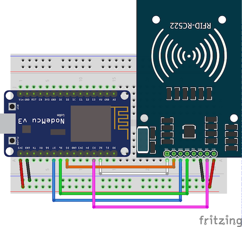

# Implementasi Program RFID

## Tujuan
- Mampu memahami cara kerja sensor RFID
- Mampu membuat program untuk membaca TAG ID kartu RFID
- Mampu membuat program untuk mendeteksi apakah kartu RFID telah teregister atau tidak
- Mampu membuat program untuk menampilkan keterangan “REGISTER” atau “NOT REGISTER” pada layar LCD serta menginstruksikan LED nyala atau mati ketika kartu RFID terdeteksi

## Capaian
- Menjelaskan cara kerja kartu RFID dan frekensinya
- Membaca TAG ID kartu RFID
- Menghidupkan LED jika TAG RFID terdaftar dalam program
- Menampilkan keterangan “Kartu Ter-register” dan “Kartu ditolak” untuk setiap kartu yang dibaca

## Teori Singkat
RFID kepanjangan dari _Radio Frequency Identification_ merupakan sebuah teknologi nirkabel untuk mengirimkan data melalui gelombang radio. Dengan menggunakan RFID kita dapat melacak sebuah objek secara otomatis tanpa bersentuhan langsung dengan objek tersebut, RFID memiliki jangkauan baca antara beberapa Cm sampai dengan lebih dari 20 meter tergantung dari jenis RFID.

### Tipe RFID
RFID terdapat beberapa jenis sesuai dengan Electronic Spectrum pada gambar di bawah ini

> Warna orange menandakan frekuensi yang digunakan oleh aplikasi RFID
+ _Low Frequency_ 

  Bekerja secara umum pada range 30 - 300 KHz biasanya digunakan di frekuensi 125 - 134 KHz. Untuk jarak bacanya adalah kontak atau bersentuhan sampai dengan 10cm

+ _High Frequency_

  Digunakan pada frekuensi 13.56 KHz. Untuk jarak bacanya adalah hampir tidak  bersentuhan sampai dengan 30cm

+ _Ultra High Frequency_
  
  Bekerja pada frekuensi 300 - 3000 KHz.

### Cara Kerja RFID
Agar RFID bisa berjalan dan digunakan dibutuhkan beberapa perangkat yang ditunjukkan pada gambar di bawah ini


+ _Readers_ adalah perangkat yang digunakan untuk melakukan pembacaan tag RFID, berfungsi sebagai penerima dan mengirimkan gelombang radio untuk berkomunikasi dengan tag RFID.
+ _Antena_ sebuah komponen yang terdapat di dalam sebuah tag RFID, biasanya berbentuk lilitan tembaga.
+ _Tag_ terdiri dari antena untuk mengirimkan dan menerima sinyal dan chip RFID untuk menyimpan informasi.

RFID dapat digunakan pada public transportation, membership, id card, dan berbagai sektor lainnya.

## Praktikum
Pada praktikum kali ini akan menggunakan reader RC522 dan tag smartcard mifare 1K.



| MFRC522 | ESP8266       |
|---------|---------------|
| SDA     | D2 \(GPIO4\)  |
| SCK     | D5 \(GPIO14\) |
| MOSI    | D7 \(GPIO13\) |
| MISO    | D6 \(GPIO12\) |
| IRQ     | \-            |
| GND     | GND           |
| RST     | D3 \(GPIO0\)  |
| 3V3     | 3V3           |

Silakan dibuat kode dibawah ini, kemudian upload kode tersebut ke controller atau esp8266 Anda.

> Sebelum menggunakan reader MFRC522 silakan download library di [sini](https://github.com/miguelbalboa/rfid.git) atau melalui arduino ide.

```cpp
#include <SPI.h>
#include <MFRC522.h>

#define SS_PIN 4  //D2
#define RST_PIN 5 //D1

MFRC522 mfrc522(SS_PIN, RST_PIN); // Create MFRC522 instance.

void setup()
{
  Serial.begin(115200); // Initiate a serial communication
  SPI.begin();          // Initiate  SPI bus
  mfrc522.PCD_Init();   // Initiate MFRC522
}

void loop()
{
  Serial.println("Waiting card...");
  // Look for new cards
  if (!mfrc522.PICC_IsNewCardPresent())
  {
    delay(50);
    return;
  }
  // Select one of the cards
  if (!mfrc522.PICC_ReadCardSerial())
  {
    delay(50);
    return;
  }
  // Show some details of the PICC (that is: the tag/card)
  Serial.print(F("Card UID:"));
  dump_byte_array(mfrc522.uid.uidByte, mfrc522.uid.size);
  Serial.println();
}

// Helper routine to dump a byte array as hex values to Serial
void dump_byte_array(byte *buffer, byte bufferSize)
{
  for (byte i = 0; i < bufferSize; i++)
  {
    Serial.print(buffer[i] < 0x10 ? " 0" : " ");
    Serial.print(buffer[i], HEX);
  }
}
```
Dari program di atas seharusnya ketika dijalankan akan menampilkan serial dari sebuah tag rfid, smartcard.

Praktikum yang kedua mencoba membuat LED RGB yang nantinya akan dikombinasikan dengan praktikum yang sebelumnya.


Pada dasarnya LED RGB terdiri dari 2 jenis yaitu common cathode dan common anode.
1. `Common cathode (-)`, kaki yang paling panjang adalah GND
2. `Common anode (+)`, kaki yang paling panjang adalah VCC

Dengan perbedaan jenis LED yang digunakan, cara penggunaannya juga berbeda. Perbedaannya tersebut adalah ketika akan menghidupkan jenis LED annode dilakukan `HIGH`, sedangkan LED cathode dilakukan `LOW`.


```cpp
#define RED D5
#define GREEN D6
#define BLUE D7

void setup()
{
  pinMode(RED, OUTPUT);
  pinMode(GREEN, OUTPUT);
  pinMode(BLUE, OUTPUT);

  digitalWrite(RED, HIGH);
  digitalWrite(GREEN, HIGH);
  digitalWrite(GREEN, HIGH);
}

void loop()
{
  digitalWrite(RED, LOW);
  digitalWrite(GREEN, HIGH);
  digitalWrite(BLUE, HIGH);
  delay(500);

  digitalWrite(RED, HIGH);
  digitalWrite(GREEN, LOW);
  digitalWrite(BLUE, HIGH);
  delay(500);

  digitalWrite(RED, HIGH);
  digitalWrite(GREEN, HIGH);
  digitalWrite(BLUE, LOW);
  delay(500);
}
```

Silakan diupload program di atas ke esp8266 Anda, seharusnya jika semuanya normal maka akan menyala secara bergantian menyala merah, hijau, dan biru.

```
  pinMode(RED, OUTPUT);
  pinMode(GREEN, OUTPUT);
  pinMode(BLUE, OUTPUT);
```
Potongan kode di atas digunakan untuk mengkonfigurasi atau menentukan pin-pin yang digunakan sebagai pin out sesuai dengan pin yang telah dideklarasikan di atas yaitu `RED, GREEN, dan BLUE.`

```
  digitalWrite(RED, HIGH);
  digitalWrite(GREEN, HIGH);
  digitalWrite(GREEN, HIGH);
```
Baris perintah di atas akan melakukan inisialisasi LED untuk diredupkan, karena LED yang digunakan menggunakan common anode sehingga menggunakan `HIGH`.

## Tugas
Buatlah sebuah aplikasi yang sederahana menggunakan RFID, LED RGB, dan LCD. Skenarionya adalah sebagai berikut
1. Buatlah ketiga komponen tersebut di dalam satu rangkaian menggunakan fritzing.
2. Daftarkan beberapa UID kartu terlebih dahulu di program yang Anda buat.
3. Ketika RFID diletakan atau ditempelkan pada reader dengan kartu yang terdaftar lampu hijau akan menyala dan pada LCD akan tertampil `Silakan Masuk`.
4. Ketika RFID diletakan atau ditempelkan pada reader dengan kartu yang tidak terdaftar lampu merah akan menyala dan pada LCD akan tertampil `Dilarang Masuk`.
5. Ketika tidak ada kartu yang ditempelkan lampu biru akan berkedip-kedip.