# Installasi dan konfigurasi IoT Local Server Dengan Raspberry Pi

## Tujuan
- Mampu menginstalasi dan mengkonfigurasi Linux Mate dan aplikasi IoT Blynk Server pada Raspberry Pi 3
- Mampu menjalankan service IoT Blynk server pada Raspberry Pi 3

## Capaian
- Menjelaskan tahapan instalasi Blynk IoT Server pada Raspberry PI 3
- Mengkonfigurasi Blynk Server pada Raspberry PI 3

## Teori Singkat
### Raspberry Pi
Raspberry Pi, sering disingkat dengan nama Raspi, adalah komputer papan tunggal (single-board circuit; SBC) yang seukuran dengan kartu kredit yang dapat digunakan untuk menjalankan program perkantoran, permainan komputer, dan sebagai pemutar media hingga video beresousi tinggi. Raspberry Pi dikembangkan oleh yayasan nirlaba, Rasberry Pi Foundation, yang digawangi sejumlah pengembang dan ahli komputer dari Universitas Cambridge, Inggris. Ide dibalik Raspberry Pi diawali dari keinginan untuk mencetak pemrogram generasi baru. Seperti disebutkan dalam situs resmi Raspberry Pi Foundation, waktu itu Eben Upton, Rob Mullins, Jack Lang, dan Alan Mycroft, dari Laboratorium Komputer Universitas Cambridge memiliki kekhawatiran melihat kian turunnya keahlian dan jumlah siswa yang hendak belajar ilmu komputer. Mereka lantas mendirikan yayasan Raspberry Pi bersama dengan Pete Lomas dan David Braben pada 2009. Tiga tahun kemudian, Raspberry Pi Model B memasuki produksi massal. Dalam peluncuran pertamanya pada akhir Febuari 2012 dalam beberapa jam saja sudah terjual 100.000 unit. Pada bulan Februari 2016, Raspberry Pi Foundation mengumumkan bahwa mereka telah menjual 8 juta perangkat Raspi, sehingga menjadikannya sebagai perangkat paling laris di Inggris. 

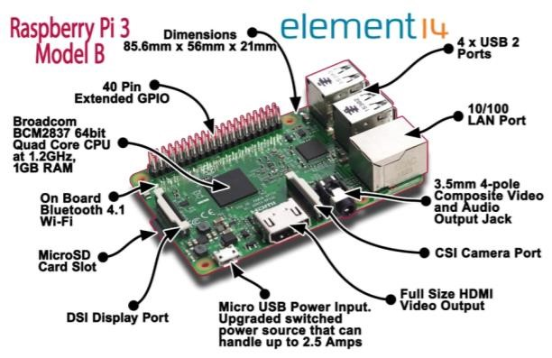

Berikut ini spesifikasi dari Raspberry Pi 3 : 
- SoC: Broadcom BCM2837 
- CPU: 4× ARM Cortex-A53, 1.2GHz 
- GPU: Broadcom VideoCore IV 
-	RAM: 1GB LPDDR2 (900 MHz) 
-	Networking: 10/100 Ethernet, 2.4GHz 802.11n wireless 
-	Bluetooth: Bluetooth 4.1 Classic, Bluetooth Low Energy 
-	Storage: microSD 
-	GPIO: 40-pin header, populated 
-	Ports: HDMI, 3.5mm analogue audio-video jack, 4× USB 2.0, Ethernet, Camera Serial Interface (CSI), Display Serial Interface (DSI) 
 
Dibangun dengan sistem-on-chip (SoC) Broadcom BCM2837 yang mencakup empat fitur : ARM Cortex-A53 processing core berjalan pada 1.2GHz dengan 32KB Level 1 dan 512 KB Level 2 cache memory, sebuah prosesor grafis VideoCore IV , dan terhubung dengan modul memori 1GB LPDDR2 di bagian belakang papan. Raspberry Pi terbaru menawarkan dukungan operasi multi-threaded dengan mengambil keunggulan dari empat processing core pada Pi 2 dan Pi 3. SysBench mengungkapkan pengembangan desain Raspberry Pi dari pertama hingga terakhir, menunjukkan kinerja single-threaded telah meningkat pesat, dan keunggulan terbesar pada saat dijalankannya program multi-threaded 

### Blynk
Blynk mendukung platform perangkat keras seperti Arduino, Raspberry Pi, dan papan mikrokontroler serupa untuk membangun perangkat keras untuk proyek Anda. Berikut ini adalah daftar dari beberapa papan mikrokontroler yang dapat digabungkan dengan Blynk: 
- Espressif (ESP8266, ESP32, NodeMCU, WeMos D1, Adafruit HUZZAH, SparkFun Blynk Board, SparkFun ESP8266 Thing) 
-	Linux (C ++) (Raspberry Pi, Ubuntu) 
-	Arduino (Arduino UNO, Arduino MKR1000, Arduino MKRZero, Arduino Yun, 
- Arduino 101, Arduino Nol, Arduino M0, Arduino M0 Pro, Arduino Nano, Arduino 
Leonardo, Arduino Karena, Arduino Mega 2560, Arduino Mega 1280, Arduino 
Mega ADK , Arduino Pro Micro, Arduino Mini, Arduino Pro Mini, Arduino Fio, 
Arduino Decimilia, Arduino Duemilanove, Arduino Pro, Arduino Ethernet, 
Arduino Leonardo ETH, Arduino Industrial 101) 

Anda dapat membaca daftar perangkat keras terbaru yang dapat Anda gunakan dengan Blynk di [sini](https://github.com/blynkkk/blynkkk.github.io/blob/master/SupportedHardware.md) 

#### Jenis koneksi 
Blynk mendukung jenis koneksi berikut untuk menghubungkan papan mikrokontroler Anda (perangkat keras) dengan Blynk Cloud dan server pribadi Blynk: 
- Ethernet 
-	Wi-Fi 
-	Bluetooth 
-	Seluler 
-	Serial 
 
#### Arsitektur Blynk 
Platform Blynk meliputi komponen berikut: 
- Aplikasi mobile Blynk : Memungkinkan Anda membangunaplikasi untuk proyek Anda menggunakan berbagai widget. Ini tersedia untuk platform Android dan iOS. 
-	Server Blynk : Bertanggung jawab untuk semua yangkomunikasi antara perangkat seluler Anda yang menjalankan aplikasi Blynk dan perangkat keras. Anda dapat menggunakan Blynk Cloud atau menjalankan server Blynk pribadi Anda secara lokal. Ini open source, dapat dengan mudah menangani ribuan perangkat, dan bahkan dapat diluncurkan pada Raspberry Pi. 
-	Library Blynk : Memungkinkan komunikasi dengan paraserver dan memproses semua perintah masuk dan keluar dari aplikasi Blynk dan perangkat keras Anda. Mereka tersedia untuk semua platform perangkat keras yang populer. 

Semua komponen yang disebutkan di atas saling berkomunikasi satu sama lain untuk membangun aplikasi IoT yang berfungsi penuh yang dapat dikontrol dari mana saja melalui tipe konektivitas yang telah dikonfigurasikan sebelumnya. Anda dapat mengontrol perangkat keras Anda dari aplikasi Blynk yang berjalan di perangkat seluler Anda melalui Blynk Cloud atau server pribadi Blynk. Ini bekerja dengan mengirim baris data yang diproses dari perangkat keras ke aplikasi Blynk Anda. 

## Praktikum 1 Menyiapkan server Blynk di Raspberry Pi
Berikut meruapakan Langkah-langkah untuk melakukan instalasi serta mengatur local server Blynk pada RaspberryPi. Server Blynk mendukung semua versi board Raspberry Pi. Namun, Raspberry Pi 3 ke-atas memberikan kinerja yang lebih baik untuk menjalankan local server. 
Untuk tujuan pengujian, Anda dapat menggunakan papan Raspberry Pi 3 untuk menjalankan local server Blynk.  
### Hardware Preparation: 
- RaspberryPi 3 
-	Micro USB cable 
-	PC/laptop 
 
### Skema

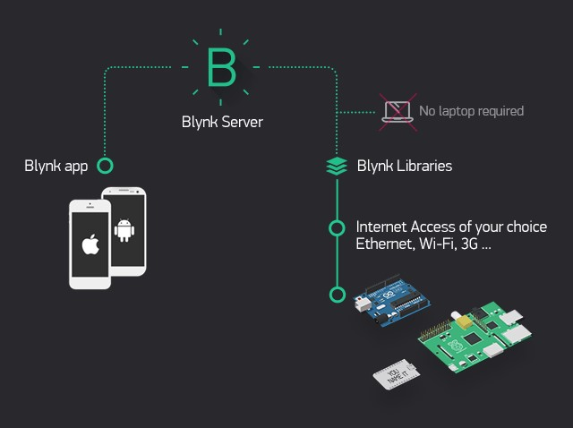

1. Dengan menggunakan Putty, masuk ke Raspberry Pi Anda melalui SSH. 
2. Instal Java 8 menggunakan perintah berikut: 
 
3. Verifikasi versi Java menggunakan perintah berikut: 
    ```shell script
    pi@raspberrypi:~ $ java -version
    ```  
4. Unduh file JAR server Blynk menggunakan perintah berikut:
    ```shell script
    wget https://github.com/blynkkk/blynk-server/releases/download/v0.41.12/server-0.41.12-java8.jar
    ```   	
5.	Beri nama file `server-0.41.12-java8.jar` untuk server Blynk yang akan diunduh ke Raspberry Pi. 
6.	Jalankan server (file JAR) pada port default perangkat keras 8080 dan port aplikasi default 9443(port SSL): 
    ```shell script
    java -jar server-0.41.12-java8.jar -dataFolder /home/pi/Blynk
    ``` 
7.	Anda akan mendapatkan output berikut untuk pertama kalinya: 
    ```shell script
    Blynk Server successfully started.
    All server output is stored in current folder in 'logs/blynk.log' file.
    ``` 
8.	Email dan kata sandi yang diberikan digunakan untuk masuk sebagai admin di aplikasi Blynk yang berjalan perangkat smartphone anda 
9.	Lakukan restart, Anda akan mendapatkan output berikut: 
    ```shell script
    Blynk Server 0.41.12-SNAPSHOT successfully started. 
    All server output is stored in folder '/home/pi/logs' file. 
    ```
    
### Mengaktifkan autostart dengan rc.local
Anda dapat mengkonfigurasi Raspberry Pi untuk melakukan autostart server Blynk Anda ketika sistem dimulai: 
1. Di Raspberry Pi Anda, edit /etc/rc.local file menggunakan editor nano: 
    ```shell script
    pi@raspberrypi:~ $sudonano /etc/rc.local
    ``` 
2.	Tambahkan perintah berikut setelah komentar, dan tambahkan exit 0 pada baris akhir, kemudian simpan file ( Ctrl + O , diikuti oleh  Enter ) dan Keluar ( Ctrl + X ): 
3. Dan lakukan reboot pada perangkat anda 
    ```shell script
    pi@raspberrypi:~ $java -jar /home/pi/server-0.41.12.jar -dataFolder 
    /home/pi/Blynk & pi@raspberrypi:~ $sudo reboot 
    ```
    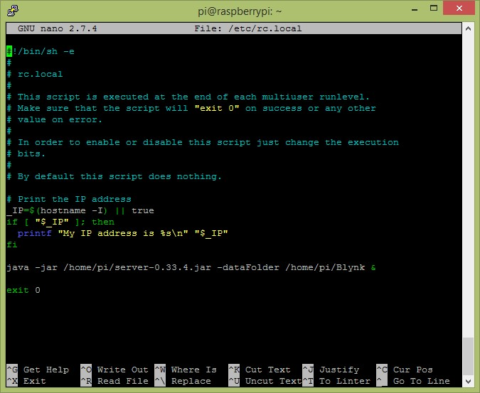
 
4. Memverifikasi bahwa server Blynk sedang berjalan 
    Ketika Anda me-restart Raspberry Pi dengan konfigurasi autostart, maka server Blynk akan di-autostart setelah perangkat menyala kembali. Anda bisa memverifikasi hal tersebut dengan menjalankan perintah berikut:
    ```shell script
    pi@raspberrypi:~ $ps -aux | grep java
    ```

> Selain menggunakan raspberry, Anda juga dapat menggunakan laptop. Yang terpenting dalah java harus sudah terinstall. 
>Sedangkan langkah `Mengaktifkan autostart dengan rc.local` harus disesuaikan dengan os yang digunakan, misalkan windows 
>tentunya ada langkah tersendiri. Untuk langkah detailnya bisa dibaca di [sini](https://github.com/blynkkk/blynk-server)

### Docker
Docker merupakan sebuah kumpulan paket dari sebuah platform yang menggunakan level OS sebagai virtualisasi dengan tujuan untuk
mendistribusikan perangkat lunak dalam sebuah paket. Paket tersebut disebut dengan istilah container. Antara container terisolasi
satu dengan yang lainnya dan dibungkus dalam perangkat lunak yang akan didistribusikan, library, dan file konfigurasi. 
Walapun antara kontainer terisolasi, tetapi antara kontainer bisa berkomunikasi dengan kontainer lainnya menggunakan channel yang didefiniskan.

> Secara detail tidak akan dijelaskan tentang docker, karena sangat luas sekali pembahasan tersebut. Mungkin membutuhkan
>waktu 1 semester untuk mempelajari platform ini.

Untuk mengunduh docker dapat didapatkan di [sini](https://www.docker.com/products/docker-desktop)

#### Install Blynk
Setelah terinstall, jalankan perintah di bawah ini pada commmand prompt atau terminal.

```
$ docker run --name blynk -p 8080:8080 -p 8441:8441 -p 9443:9443 mpherg/blynk-server:latest
Blynk Server 0.41.10 successfully started.
All server output is stored in folder '/data/logs' file.
Your Admin url is https://172.17.0.2:9443/admin
Your Admin login email is admin@blynk.cc
Your Admin password is admin
```

Perintah tersebut di atas adalah ketika blynk belum ada, maka akan download di repository docker (hub.docker.com) dengan 
versi yang terbaru. Tetapi ketika di laptop sudah ada dan versinya audah terbaru maka tidak akan mendownload.
- `-p 8080:8080 -p 8441:8441 -p 9443:9443` adalah container(blynk) exposed atau membuka port yang dapat diakses dari luar.
8080 adalah port http, 8441 adalah port mqtt, dan 9443 adalah port https.
- `mpherg/blynk-server:latest` nama image yang dijalankan atau akan didownload.
- `--name blynk` adalah nama container, sebenarnya optional dan ketika tidak diset maka akan random untuk penamaannya.

Selanjutnya, jalankan perintah di bawah ini untuk ngecek apakah blynk sudah jalan atau belum di docker
```
$docker ps
CONTAINER ID        IMAGE                        COMMAND                  CREATED             STATUS              PORTS                                                                    NAMES
d56f0cc9139d        mpherg/blynk-server:latest   "java -jar /blynk/se…"   18 seconds ago      Up 17 seconds       0.0.0.0:8080->8080/tcp, 0.0.0.0:8441->8441/tcp, 0.0.0.0:9443->9443/tcp   blynk
```

## Praktikum 2 Menghubungkan aplikasi mobile Blynk dengan lokal server
Pada umunya aplikasi mobile Blynk bekerja dengan menggunakan Blynkcloud dengan cara menghubungkannya melalui internet. Jika Anda ingin menghubungkan aplikasi mobile Blynk Anda dengan server Blynk pribadi (local server), Anda harus mengonfigurasi beberapa atribut pada aplikasi mobile Blynk. Atribut ini akan membantu Anda menemukan server Blynk pribadi yang digunakan pada jaringan yang sama (yaitu, jaringan Wi-Fi rumah Anda). Jika Anda ingin mengakses server Blynk pribadi dari internet, Anda dapat menggunakan penerusan port untuk mengaksesnya. Untuk melakukan ini, Anda juga memerlukan alamat IP statis.
> Anda harus download blynk untuk aplikasi mobile, dapat didapatkan di [sini](https://play.google.com/store/apps/details?id=cc.blynk&hl=en_US) 
 
1. Pertama, Anda harus mengonfigurasi jalur server tersendiri untuk server Blynk pribadi Anda yang berjalan di Raspberry Pi atau laptop Anda. 
2.	Di halaman login, ketuk Create New Account:
    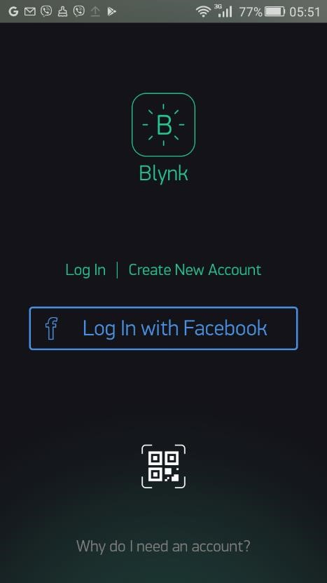
  
3.	Ketuk ikon tiga titik untuk melihat pengaturan server: 
    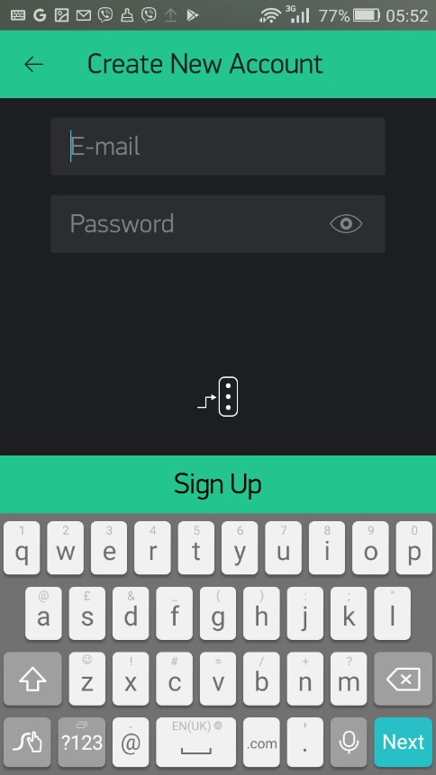
 
4.	Geser tombol sakelar dari BLYNK ke CUSTOM: 
    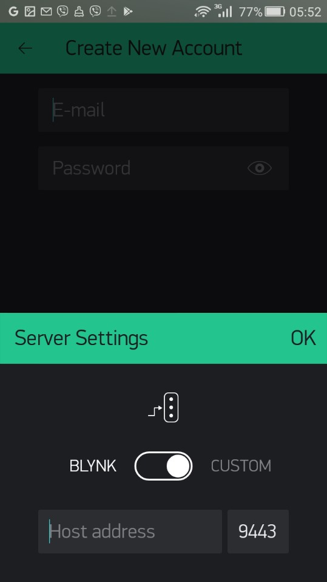
 
5.	Masukkan alamat IP Raspberry Pi atau laptop Anda sesuaikan dengan IP pada perangkat Anda masing-masing (misal, 192.168.1.4) dan nomor port. Port default untuk server Blynk adalah 9443. Lalu, ketuk OK untuk menyimpan pengaturan:  
    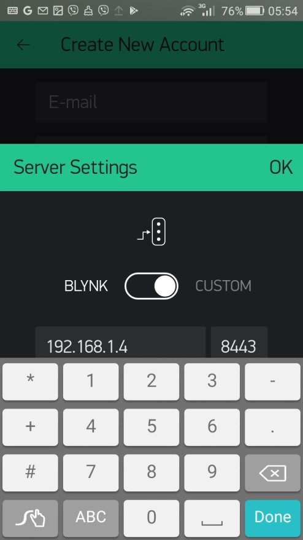
    Pengaturan server — langkah 1 

6. Ketikkan nama pengguna (alamat email) dan kata sandi untuk akun pengguna baru. 
7.	Ketuk Sign Up untuk membuat akun. Anda dapat melihat pesan `Connecting…` di bagian bawah halaman saat membuat akun. 
8.	Setelah membuat akun, aplikasi akan menunjukkan tips tentang cara kerja energi. Ketuk tombol `Cool! Got it` dan Anda akan pergi ke dasbor proyek: 
 
## Praktikum 3 Membuat proyek baru untuk mendapatkan token autentikasi 
 
Untuk menjalankan proyek, Anda akan memerlukan token autentikasi terkait dengan proyek pembuat aplikasi Blynk di bawah server pribadi Blynk Anda: 
1. Ketuk `New Project`. Anda akan mendapatkan tampilan halaman Create New Project seperti berikut: 
    
    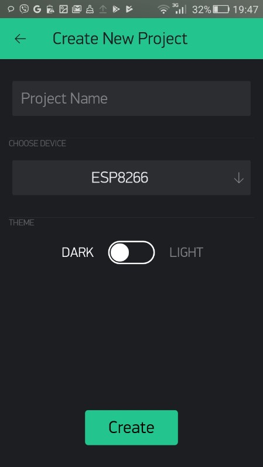
    
2.	Pada halaman `Create New Project`, isikan nama proyek di `Project Name` dan pilih jenis perangkat keras yang anda pakai. Dalam hal ini, Anda harus memilih model controller IoT yang akan digunakan atau tempat menjalankan program. misalkan ESP2866. Lalu, ketuk OK: 
    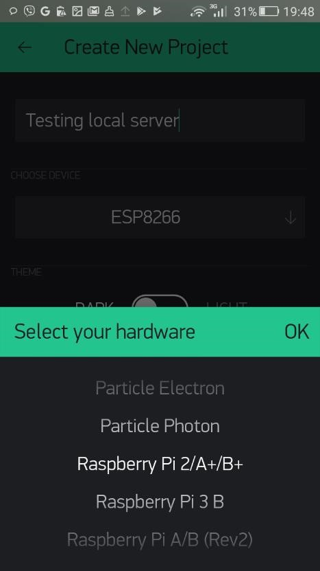
    
3.	Sekarang, halaman `Create New Project` Anda seharusnya terlihat seperti tangkapan layar sebelumnya. Ketuk tombol Create untuk membuat ruang kerja proyek: 
    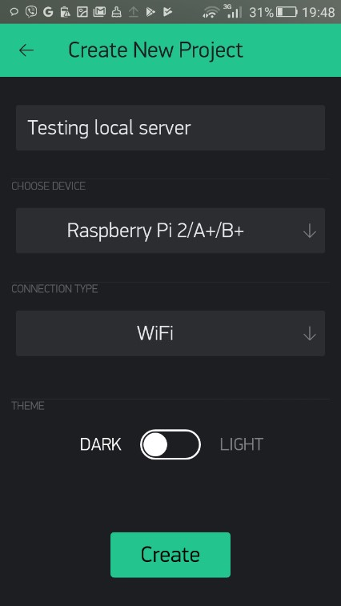
 
4.	Anda akan mendapatkan pemberitahuan tentang token autentikasi. Ketuk OK untuk menutup pesan: 
    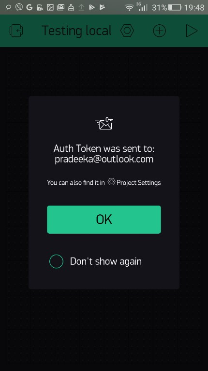
    
5.	Ketuk ikon Project Settings pada bilah alat untuk membuka halaman Project Settings. Di bawah AUTH TOKENS, ketuk Copy all. Token autentik akan disalin ke clipboard: 
    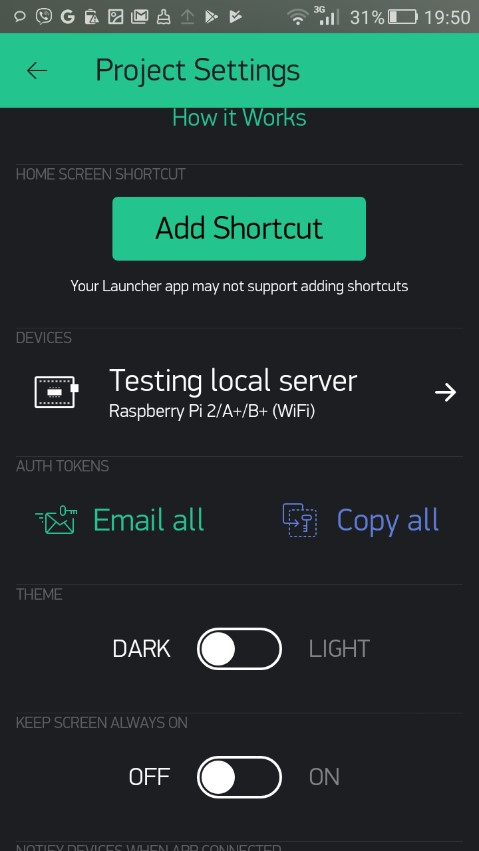
    
6.	Buka aplikasi Notepad (atau editor teks) dan paste item yang disalin untuk melihat token autentikasi: 
 
## Praktikum 4 Menggunakan antarmuka administrasi 
 
Mengacu pada langkah-langkah berikut, Anda dapat membuka antarmuka administrasi dengan memasukkan alamat berikut di browser web: 
1. Membuka halaman admin di web browser 
    ```shell script
    https://IP_ADDRESS:9443/admin 
    ```
2. Ketik kredensial administrator default untuk login. Berikut adalah kredensial login default untuk admin: 
    ```shell script
    Email address: admin@blynk.cc 
    Password: admin
    ```
3.	Klik Sign-in untuk masuk ke antarmuka administrator: 
    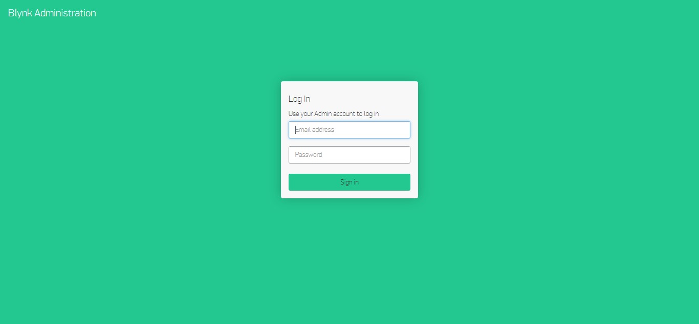
  
4.	Selanjutnya anda kemudian akan melihat dasbor sebagai berikut:
    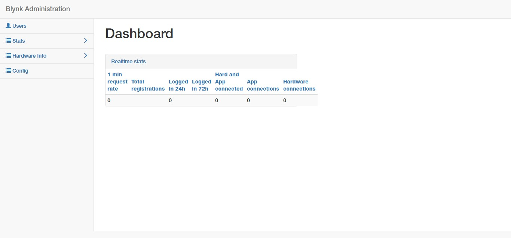 
  
5.	Di daftar sebelah kiri, klik Users. Anda akan mendapatkan yang daftar akun pengguna yang terdaftar di server Blynk lokal Anda, termasuk admin:
    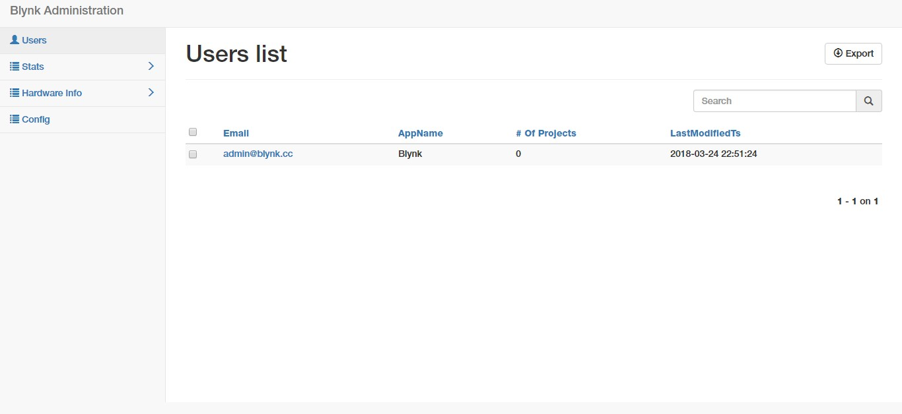 
  
6.	Di panel navigasi sebelah kiri, klik Config. Anda akan mendapatkan daftar konfigurasi untuk yang berikut:
```
twitter4j.properties: Ini diperlukan untuk pemberitahuan Twitter 
single_token_mail_body.txt server.properties: Pengaturan yang terkait dengan server 
mail.properties: Diperlukan untuk pemberitahuan email 
gcm.properties: Diperlukan untuk pemberitahuan telepon 
db.properties: Pengaturan yang terkait dengan database
```  

## Tugas
Buat laporan dari hasil praktikum yang telah anda lakukan