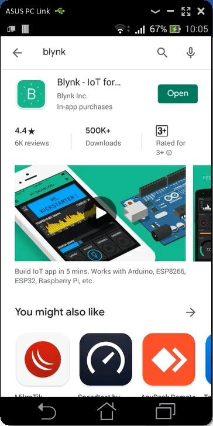

# Monitoring dan Controlling pada IoT Local Server

## Tujuan
- Instalasi aplikasi Blynk (subscriber) pada perangkat mobile (Android, IPhone)
- Membuat design dan konfigurasi blynk client (subscriber), disesuaikan dengan Device MCU (sensor pada publisher)
- Menampilkan data logger sensor ke aplikasi blynk mobile
- Mengendalikan MCU (aktuator) dari subscriber blynk client

## Capaian
- Mampu menginstalasi dan mengkonfigurasi Blynk Client pada perangkat mobile android atau iPhone
- Mampu merancang antarmuka blynk client sebagai subscriber
- Mampu menampilkan data sensor dari MCU (publisher) ke blynk clinet mobile (subscriber)
- Mampu mengendalikan MCU dari blynk mobile

### Project IoT Blynk Local Server
Blynk.IO adalah IoT Server yang mana client yang mengakses lebih ditekankan pada perangkat bergerak, misalnya smartphone dan tablet. Blynk.IO menyediakan berbagai jenis platform seperti IOS untuk Iphone dan Android. Blynk.IO juga mendukung berbagai jenis device misalnya Arduino, NodeMCU. Anda dapat membaca lebih lanjut di halaman https://blynk.io/en/getting-started.

### Blynk Pada NodeMCU
Agar NodeMCU mengenali fitur-fitur yang terdapat pada Blynk, maka kita harus menambahkan library blynk ke dalam NodeMCU. Seperti biasa tambahkan melalui menu Tools > Manage Libraries, ketikkan “blynk” untuk mencari library blynk.

### Desain Rancangan Smartdevice NodeMCU
Adapun rancangan devicenya adalah sebagai berikut


> Jika terdapatkan kesalahan pengkabelan atau pengalamatan input/output maka silahkan disesuaiakan. Gambar hanyalah ilustrasi, berdasarkan kode program saya anggap kalian sudah paham bagaimana seharusnya wiring yang benar.

### Kode Program Pada NodeMCU
```cpp
#define BLYNK_PRINT Serial 
 
#include <TinyGPS++.h> 
#include <SoftwareSerial.h> 
#include <SimpleTimer.h> 
#include <ESP8266WiFi.h> 
#include <BlynkSimpleEsp8266.h> 
#include <SimpleDHT.h> 
#include <LiquidCrystal_I2C.h> 
#include <Servo.h> 
 
#define pinServo 13 Servo myservo; int degServo = 0; 
 
#define TX_GPS 14 
#define RX_GPS 12 
#define pinLedMerah 16 //D0 pin led merah 
#define pinLedKuning 0 //D3 pin led kuning 
#define pinLedHijau 2 //D4 pin led hiaju 
#define pinDHT 10 // SD3 pin signal sensor DHT 
 
SimpleTimer timerDHT; 
 
//dibangkitkan saat membuat projek Blynk 
//cek di email konfirmasi Anda 
char auth[] = "m6X-9KmShTi_mIi-EvMSRWF8N5auY6M5"; //lokal server, sesuaikan dengan token blynk masing-masing 
//char auth[] = "QGNNlp_hfvBCqhMuLxijr1_FoNzPrsP6"; //Blynk server, sesuaikan dengan token blynk masing-masing 
char ssid[] = "Fanny 2004"; // SSID, silahkan disesuaikan 
char pass[] = "fanny_200504"; //Password AP, silahkan disesuaikan 
 
SoftwareSerial UART_GPS(RX_GPS , TX_GPS); 
TinyGPSPlus gps; 
 
//instan objek sensor dht11 
SimpleDHT11 dht11(pinDHT); 
 
//instan objek LCD I2C 
LiquidCrystal_I2C lcd(0x27, 16, 2); 
 
//membuat karakter derajat custom 
//https://maxpromer.github.io/LCD-Character-Creator/ 
byte derajat[] = { 
  B01110, 
  B10001, 
  B10001, 
  B10001, 
  B01110, 
  B00000, 
  B00000,   
  B00000 
}; 
 
//WidgetLCD lcd_blynk(V5); 
WidgetMap myMap(V4); 
 
void setup() {     
  myservo.attach(pinServo);   
  myservo.write(degServo);   
   
  Serial.begin(9600); 
  UART_GPS.begin(9600); //inisialisasi GPS 
  //Blynk.begin(auth, ssid, pass); // blynk server 
  Blynk.begin(auth, ssid, pass, "192.168.1.4", 8080); //lokal server   pinMode(pinLedMerah, OUTPUT);   pinMode(pinLedKuning, OUTPUT);   pinMode(pinLedHijau, OUTPUT);   pinMode(pinDHT, INPUT);   KonfigurasiLCD(); 
  timerDHT.setInterval(2000, KelembabanSuhu); 
  //timerGPS.setInterval(2000, Lokasi_gps); 
}  

void loop() {   
  Blynk.run();   
  timerDHT.run();     
  smartDelay(1000); 
  Lokasi_gps(); 
} 
 
BLYNK_WRITE(V5) 
{   
  degServo = param.asInt();  
  myservo.write(degServo);   
}  

void KonfigurasiLCD() {   
  lcd.begin(); // Inisialisasi LCD   
  lcd.createChar(0, derajat); 
  lcd.backlight(); // Menghidupkan backlight   
  lcd.setCursor(0, 0);   
  lcd.print(" Welcome UNISBA ");   
  lcd.setCursor(0, 1);   
  lcd.print("   PROJECT 4    ");   
  delay(3000);   
  lcd.clear(); 
}  

void KelembabanSuhu() {   
  byte temperature;   
  byte humidity; 
  int err = SimpleDHTErrSuccess; 
 
  if ((err = dht11.read(&temperature, &humidity, NULL)) != SimpleDHTErrSuccess) 
  { 
    Serial.print("Pembacaan DHT11 gagal, err="); 
    Serial.println(err);     
    delay(1000);
    return; 
  } 
 
  Serial.print("Sample OK: "); 
  Serial.print((int)temperature); 
  Serial.print(" *C, "); 
  Serial.print((int)humidity); 
  Serial.println(" H"); 
  Serial.println("Derajat Servo: " + String(degServo)); 
 
  Blynk.virtualWrite(V0, temperature); 
  Blynk.virtualWrite(V1, humidity); 
 
  lcd.clear(); 
  /* 
  lcd.setCursor(0, 0); 
  lcd.print("Temperatur: " + String((int)temperature));   lcd.write(0);   lcd.print("C");   lcd.setCursor(0, 1); 
  lcd.print("Kelembaban: " + String((int)humidity) + "H"); 
  */ 
  lcd.setCursor(0, 0); 
  lcd.print("Tem:" + String((int)temperature));   lcd.write(0);   lcd.print("C "); 
  lcd.print("Hum:" + String((int)humidity) + "H");     lcd.setCursor(0, 1);   
  lcd.print("Servo Deg:" + String(degServo));   lcd.write(0);   
}  

void Lokasi_gps() { 
  Serial.println("Lat: " + String(gps.location.lat()) + " - Lng: " + gps.location.lng()); 
  Blynk.virtualWrite(V2, "Lint.:" + String(gps.location.lat(), 6));   
  Blynk.virtualWrite(V3, "Bujur:" + String(gps.location.lng(), 6));   
  myMap.location(2, gps.location.lat(), gps.location.lng(), "Lokasi Saya"); 
}  

static void smartDelay(unsigned long ms) 
{ 
  unsigned long start = millis();   
  do   { 
    while (UART_GPS.available())       
    gps.encode(UART_GPS.read());   
  } while (millis() - start < ms); 
} 
```

### Konfigurasi Pada Blynk Android 
Download dan install aplikasi blynk dari plystore 

  

Buat koneksi antara Blynk sebagai subscriber dengan Raspberry Pi 3 sebagai server IoT. Pada kasus ini kita menggunakan local server yang saya sediakan.


 
> Klik pada bagian titik tiga berbentuk vertikal untuk mengubah IP Server blynk.


> Pilih Custom untuk mengatur IP lokal Blynk Server, selanjutnya tuliskan IP server blynk


> Isikan username dan password sesuai dengan proses pendaftaran sebelumnya.

Buat tampilan interface seperti berikut, dimana komponen widget terdiri dari: 
- Button 3x 
- Slider 1x 
- Gauge 2x 
- SuperChart 1x 
- LCD 1x 
- Map 1x 

 


> Buatlah widget seperti tampilan di atas
  
### Konfigurasi Button D0 (LED MERAH)

> Kendali LED secara digital. D0 merujuk pada label alamat D0 NODEMCU 
 
### Konfigurasi Button D3 (LED KUNING)
 
 
### Konfigurasi Button D4 (LED HIJAU)
 
  
### Konfigurasi Slider Kontrol Servo

> Tipe variabel adalah virtual, dengan alamat V5. Nilai minmal dan maksimal di sebelah kanannya. 
 
 
### Konfigurasi Gauge Temperatur

> Untuk memberikan satuan, bisa ditambahkan pada bagian LABEL 
 
 
### Konfigurasi Gauge Kelembaban 


 
### Konfigurasi SuperChart (Pergerakan Suhu dan Kelembaban) 
 
> Dalam satu chart terdapat 2 datastream, yaitu suhu dan kelembaban. Untuk menambahkan data stream silakan klik button
>`Add Datastream` 

 

 

 
 

 

 

 
  	 
### Konfigurasi LCD (Posisi Bujur Lintang) 


  
 	 
### Konfigurasi MAP 

 	 
Copy Token Blynk Ke NodeMCU 

 

> Daftar device yang tersedia pada Blynk sesuai akun masing-masing 

> Contoh nama device saya beri nama `Monitoring Unisba`. 
>Punya kalian silahkan diberi nama bebas. Device dibentuk saat membuat akun pertama kali 


> Setiap device akan digenerate sebuah Token, yang harus dituliskan pada NodeMCU.
 	 
### Jalankan Aplikasi Blynk 

> Jangan lupa klik tombol play pada pojok kanan atas untuk menjalankan aplikasi IoT
>
Jika muncul gambar di bawah ini maka berarti ada kesalahan koneksi atau salah kode tokennya, silahkan cek ulang. 

> Device belum terhubung dengan server Blynk 
 
Jika kalian lupa tokennya, silahkan buka halaman dashboard web server Blynk, contoh https://192.168.1.100:9443. Dengan user admin@blynk.cc dan password admin. Berikut ini ilustrasinya: 
 
> Login superadmin Blynk Dashboard, pilih menu user dan pilih salah satu user


> Token harus dituliskan pada device
 
## Tugas 
Buat laporan untuk tahapan di atas. 
